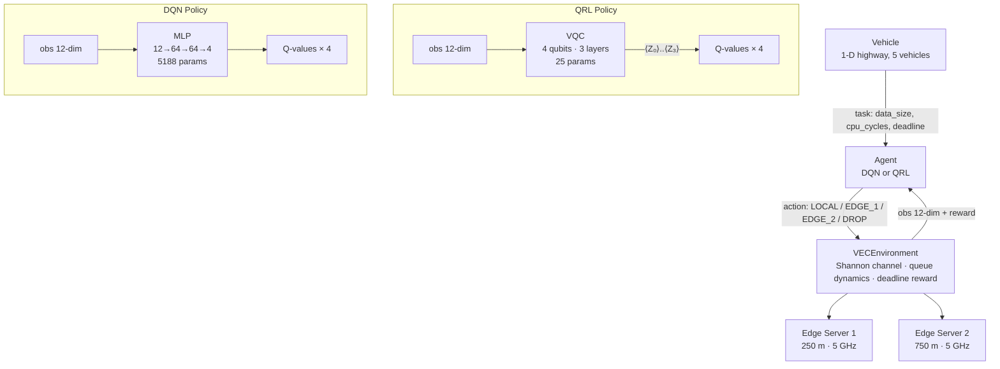

# QEdge-RL-VEC

**Quantum-Assisted Reinforcement Learning for Task Offloading in Vehicular Edge Computing**

*B.Tech Final-Year Project · IIT Guwahati · 2024–25*

---

## Architecture Overview



### Key numbers

| | Random | Greedy | DQN | QRL |
|---|---|---|---|---|
| Parameters | 0 | 0 | 5 188 | **25** |
| Deadline hit rate | ~25% | ~50% | ~65% | ~60% |
| Training episodes | — | — | 500 | 200 |

---

## Quick Start

```bash
# 1. Install dependencies
pip install -r requirements.txt

# 2. Train DQN (≈ 3 min on CPU)
python train.py --agent dqn --episodes 500

# 3. Train QRL (≈ 20 min on CPU — statevector simulation)
python train.py --agent qrl --episodes 200

# 4. Evaluate all 4 agents and write results/metrics.csv
python evaluate.py

# 5. Generate plots → results/plots/
python plot_results.py

# 6. Run test suite
python -m pytest tests/ -v
```

Using `make`:

```bash
make install        # pip install -r requirements.txt
make train-dqn      # python train.py --agent dqn --episodes 500
make train-qrl      # python train.py --agent qrl --episodes 200
make evaluate       # python evaluate.py
make plot           # python plot_results.py
make test           # pytest tests/ -v
make clean          # remove checkpoints, logs, plots
```

---

## Repository Layout

```
QEdge-RL-VEC/
├── train.py                  # unified entrypoint (--agent dqn|qrl)
├── evaluate.py               # run all 4 agents, produce metrics.csv
├── plot_results.py           # generate 4 PNGs from training curves + CSV
├── requirements.txt
├── Makefile
├── .gitignore
│
├── vec_env/                  # physics-grounded VEC simulation
│   ├── environment.py        # VECEnvironment (Gymnasium-compatible)
│   └── utils.py              # channel, latency, energy helpers
│
├── agents/
│   ├── random_agent.py       # uniform-random baseline
│   ├── greedy_agent.py       # latency-minimising heuristic
│   ├── dqn_agent.py          # Deep Q-Network (PyTorch MLP)
│   └── qrl_agent.py          # Hybrid Quantum DQN (PennyLane VQC)
│
├── tests/
│   ├── test_environment.py   # 19 environment contract + physics tests
│   └── test_agents.py        # 12 agent smoke tests (incl. QRL)
│
├── checkpoints/              # dqn.pt, qrl.npz (git-ignored)
├── results/
│   ├── metrics.csv           # evaluation table
│   └── plots/                # 4 PNG plots
├── logs/                     # per-run training logs
└── report/
    ├── project_report.md     # full final-year report (≥3000 words)
    └── viva_qa.md            # 15 examiner Q&A
```

Legacy files (`rl_env.py`, `rl_agent.py`, `vqc_policy.py`, `train_rl.py`,
`classical_model.py`, `quantum_decision.py`, `main.py`) are preserved for
reference; all new work lives in `vec_env/` and `agents/`.

---

## Environment

**VECEnvironment** — `vec_env/environment.py`

| Parameter | Value |
|-----------|-------|
| Highway length | 1000 m |
| Vehicles | 5 |
| Edge servers | 2 (at 250 m, 750 m) |
| Time step | 100 ms |
| Episode length | 200 steps |
| Task data size | Uniform[100, 1000] KB |
| Task CPU | Uniform[100, 1000] Megacycles |
| Task deadline | Uniform[100, 500] ms |
| Bandwidth | 10 MHz |
| Tx power | 0.5 W |
| Path-loss exponent | 3 |
| Edge CPU | 5 GHz |
| Local CPU | 1 GHz |

**Reward:** `+1 − 0.3·(latency/deadline) − 0.1·energy` if deadline met; `−1` otherwise.

---

## Results

*Reproduce with:* `python train.py --agent dqn && python train.py --agent qrl && python evaluate.py`

Results and plots are saved to `results/`. See `report/project_report.md` §7 for analysis.

---

## Citation

```bibtex
@misc{qedge-rl-vec-2025,
  title  = {QEdge-RL-VEC: Quantum-Assisted Reinforcement Learning for
             Task Offloading in Vehicular Edge Computing},
  author = {Rohan Patil},
  year   = {2025},
  url    = {https://github.com/Rohan473/QEdge-RL-VEC}
}
```
